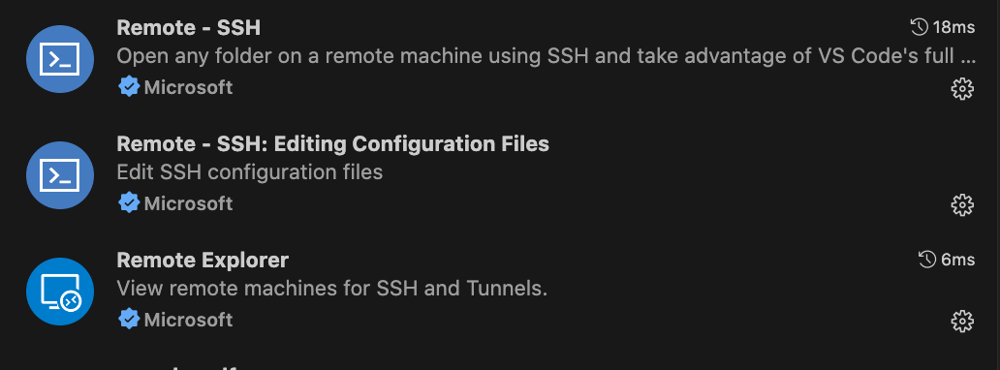
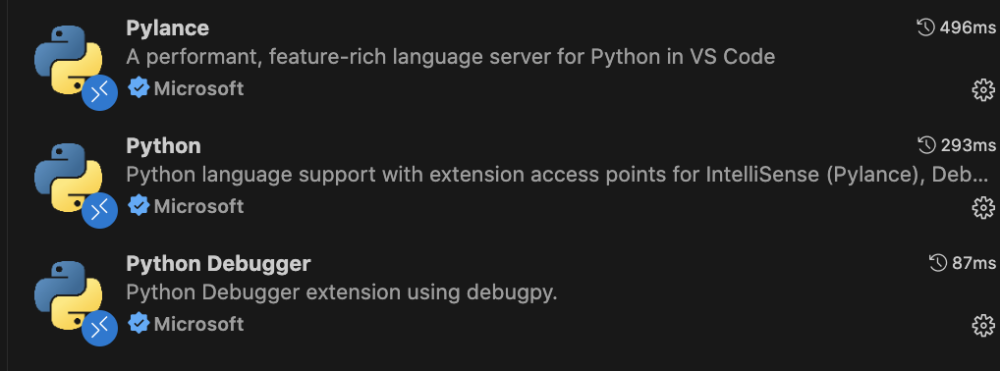

# Connecting to racc2 via SSH and VSCode (Mac users)

This guide walks Mac users through connecting to the racc2 HPC cluster without a VPN, using SSH keys and VSCode.

!!! note "Prerequisites"
    You will need an `~/.ssh/` directory both on your local machine and in your remote UoR home directory. If these do not exist, create them first.

---

## 1. Generate an SSH key

On your local machine, open a terminal and run:

```bash
ssh-keygen
```

You will be prompted to choose a file location (accept the default) and set a passphrase — make a note of it.

```
Generating public/private rsa key pair.
Enter file in which to save the key (/home/pawel/.ssh/id_rsa): 
Enter passphrase (empty for no passphrase): 
Enter same passphrase again: 
Your identification has been saved in /home/pawel/.ssh/id_rsa.
Your public key has been saved in /home/pawel/.ssh/id_rsa.pub.
The key fingerprint is:
SHA256:rAHUFoCc/pxQddysFMZ8Uf/I3AhJeMjNeVIj0JrkhsA pawel@homepc
The key's randomart image is:
+---[RSA 2048]----+
| . oo=o=+=oX+oo  |
|  +.. Eo= O.B+.. |
| . ... o * +oo.  |
|  o  . .o =  + = |
|   + .. S.    = o|
|    +  o         |
|      .          |
|                 |
|                 |
+----[SHA256]-----+
```

Next, create an `authorized_keys` file containing your new public key:

```bash
cat ~/.ssh/id_rsa.pub >> authorized_keys
```

Then copy it to your UoR remote system via the MFT service (replacing `<UoR user name>` with your username):

```bash
scp ~/.ssh/authorized_keys <UoR user name>@mft.act.reading.ac.uk:/<UoR user name>/.ssh/
```

```bash
ssh-copy-id <UoR login>@arc-ssh.reading.ac.uk
```

*(It is unclear whether this second command is strictly necessary.)*

---

## 2. Connect to racc2

With the keys in place, you can connect to the arc-ssh gateway. You will be prompted for your SSH passphrase and your UoR password:

```bash
ssh <UoR login>@arc-ssh.reading.ac.uk -X
```

To disconnect:

```bash
exit
```

What we really want is to use arc-ssh to *jump* directly to racc2, which the `-J` flag enables:

```bash
ssh -J <UoR login>@arc-ssh.reading.ac.uk <UoR login>@racc.rdg.ac.uk -Y
```

You will be asked for your UoR password once and your SSH passphrase twice.

<!-- VIDEO PLACEHOLDER: connection.mp4 — replace VIDEO_ID with your YouTube video ID -->
<iframe
  width="100%"
  height="400"
  src="https://www.youtube.com/embed/VIDEO_ID"
  title="SSH connection to racc2"
  frameborder="0"
  allowfullscreen>
</iframe>

---

## 3. Configure VSCode

You will need [VSCode](https://code.visualstudio.com/) installed on your local machine with the **Remote - SSH** extension:

{ width="300" }

For Python and notebook work, you will also want **Python**, **Python Debugger**, **Jupyter**, and **Pylance**:

{ width="300" }

### Increase connection timeout

Remote connections to racc2 can take time to establish. Navigate to your Remote-SSH settings and increase **Connect Timeout** to at least 30 seconds before proceeding.

<!-- VIDEO PLACEHOLDER: settings.mp4 — replace VIDEO_ID with your YouTube video ID -->
<iframe
  width="100%"
  height="400"
  src="https://www.youtube.com/embed/VIDEO_ID"
  title="Setting VSCode connection timeout"
  frameborder="0"
  allowfullscreen>
</iframe>

### Set up the remote connection

Use the same SSH jump command from [Section 2](#2-connect-to-racc2) to configure a new remote connection in VSCode. When prompted, open the SSH config file to see how Remote-SSH has set up the connection using `ProxyJump`.

<!-- VIDEO PLACEHOLDER: vscode_connection.mp4 — replace VIDEO_ID with your YouTube video ID -->
<iframe
  width="100%"
  height="400"
  src="https://www.youtube.com/embed/VIDEO_ID"
  title="Configuring VSCode remote connection"
  frameborder="0"
  allowfullscreen>
</iframe>

### Connect

Open the Remote Explorer panel and connect to racc2. Press the refresh icon if the new connection does not appear immediately. You will be prompted for your passphrase and password once more.

Once connected, you can browse folders, open files, download them, and open a terminal via **Terminal → New Terminal**.

<!-- VIDEO PLACEHOLDER: connect_raccn.mp4 — replace VIDEO_ID with your YouTube video ID -->
<iframe
  width="100%"
  height="400"
  src="https://www.youtube.com/embed/VIDEO_ID"
  title="Connecting via Remote Explorer"
  frameborder="0"
  allowfullscreen>
</iframe>

---

## 4. Python and Jupyter notebooks

Create a new Jupyter notebook in VSCode and select a kernel — these are detected automatically from your conda environments. If a kernel does not appear, a reliable workaround is to create a new environment through VSCode's Python extension interface. This exposes VSCode to your conda installation and allows it to find your existing environments. The newly created environment can be deleted afterwards.

<!-- VIDEO PLACEHOLDER: connect_python.mp4 — replace VIDEO_ID with your YouTube video ID -->
<iframe
  width="100%"
  height="400"
  src="https://www.youtube.com/embed/VIDEO_ID"
  title="Using Jupyter notebooks in VSCode"
  frameborder="0"
  allowfullscreen>
</iframe>

You now have the full functionality of a JupyterLab server on racc2, with the additional power of VSCode.
